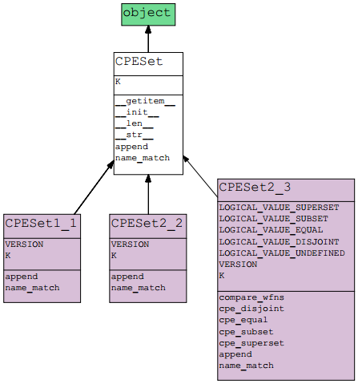
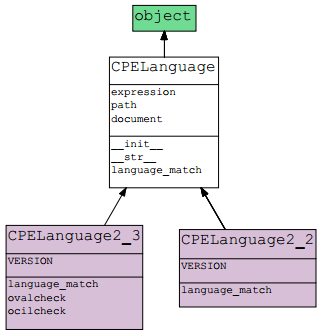

CPE PACKAGE
===========

This file intended to be a small tutorial about cpe package. It contains a brief introduction about Common Platform Enumeration (CPE) specification, the CPE version list implemented and the compatibility among them, the class model designed, the steps to install and use the cpe package (with examples), and several important issues to consider associated with the functionality of the package.

<h2 id="index">Index</h2>

1. [Introduction](#intro)  
	1.1. [Matching](#matching)
2. [List of implemented CPE versions](#versions)
3. [Compatibility among CPE versions](#compatibility)
4. [Model](#model)  
	4.1. [CPE hierarchy](#cpeh)  
	4.2. [CPESet hierarchy](#cpeseth)  
	4.3. [CPELanguage hierarchy](#cpelangh)  
	4.4. [Categories of main classes](#catclass)    
5. [Installation](#install)
6. [Usage examples](#use)  
	6.1. [Naming](#naming)  
	6.2. [Name matching](#namematching)  
	6.3. [Language matching](#langmatching)  
7. [Important issues](#issues)
8. [Bugtracker](#bugtracker)
9. [TODO](#todo)
10. [Authors](#authors)
11. [License](#license)
12. [References](#references)

<h2 id="intro">1. Introduction</h2>

Common Platform Enumeration (CPE) is a standardized method of describing and identifying classes of applications, operating systems, and hardware devices present among an enterprise's computing assets. CPE does not identify unique instantiations of products on systems, such as the installation of XYZ Visualizer Enterprise Suite 4.2.3 with serial number Q472B987P113. Rather, CPE identifies abstract classes of products, such as XYZ Visualizer Enterprise Suite 4.2.3, XYZ Visualizer Enterprise Suite (all versions), or XYZ Visualizer (all variations).

IT management tools can collect information about installed products, identifying these products using their CPE Names, and then use this standardized information to help make fully or partially automated decisions regarding the assets. For example, identifying the presence of XYZ Visualizer Enterprise Suite could trigger a vulnerability management tool to check the system for known vulnerabilities in the software, and also trigger a configuration management tool to verify that the software is configured securely in accordance with the organization's policies. This example illustrates how CPE Names can be used as a standardized source of information for enforcing and verifying IT management policies across tools [[1]][cpe].

CPE provides [[2]][about_cpe]:

* A standard machine-readable format for encoding names of IT products and platforms (naming).
* A set of procedures for comparing names (name matching).
* A language for constructing "applicability statements" that combine CPE Names with simple logical operators (language matching).
* A standard notion of a CPE Dictionary.

For more information, please visit the official website of CPE, maintained by MITRE: [http://cpe.mitre.org/](http://cpe.mitre.org/)

[--- Return to index ---](#index)

<h3 id="matching">1.1. Matching</h3>

Matching [[5]][cpe22] is the process of determining if a given CPE Name or CPE Language statement specifies a platform that is defined by a set of known CPE Names. It helps define the relationship between different CPE Names (or language statements).

#### Conceptual model

The conceptual model for matching consists of two steps:

1. Make a list of all the CPE Names and logical connections.
2. For each name, check whether the target system has the hardware, software, or operating system indicated by the name. If the check succeeds for all names, and satisfies the logical constraints, then the target is an instance of the CPE Name or Language representation.

#### Matching Algorithm: Known Instance Based Matching

Two elements participate in the matching process: the known instance set (CPE Names that define the target system) and the candidate CPE Name or Language expression. The algorithm applies the "filter" indicated by X and replies to the question: "Does the filter X return any instance of target system K?"

The figure bellow illustrates the basic concept of known instance based matching:

 

Matching consists of two algorithms.

1. CPE\_Name\_Match:
	- This algorithm accepts a set of CPE Names K and a candidate CPE Name X.
	- It returns true if X matches any member of K, and false otherwise.
2. CPE\_Language\_Match:
	- This algorithm accepts a set of CPE Names K and a candidate expression E.
	- It returns true if the expression can be satisfied by name matching against the members of K, and false otherwise.

[--- Return to index ---](#index)

<h2 id="versions">2. List of implemented CPE versions</h2>

This package implements the validation of both CPE Names and platforms (set of CPE Names), and the comparisons between them, corresponding to some versions of CPE specification [[3]][cpe_archive].

The functionality implemented in this package, associated with versions 1.1, 2.2 and 2.3 of CPE specification, is below:

* Version 1.1 [[4]][cpe11]:
 * CPE naming
 * CPE Name matching
* Version 2.2 [[5]][cpe22]:
 * CPE naming
 * CPE Name matching
 * CPE Language matching
* Version 2.3:
 * CPE naming [[6]][cpe23_naming]
 * CPE Name matching [[7]][cpe23_matching]
 * CPE Applicability Language matching [[8]][cpe23_language]

The CPE naming of version 2.3 supports the definition of three different styles of CPE Name:

* WFN: Well-Formed Name
* URI: Uniform Resource Identifier
* FS: Formatted String

[--- Return to index ---](#index)

<h2 id="compatibility">3. Compatibility among CPE versions</h2>

<table>
	<thead style='font-weight:bold;text-align:center'>
		<tr>	
			<td>VERSIONS</td>
			<td>1.1</td>
			<td>2.2</td>
			<td>2.3 WFN</td>
			<td>2.3 URI</td>
			<td>2.3 FS</td>
		</tr>
	</thead>
	<tbody style='text-align:center'>
		<tr>
			<td style='font-weight:bold'>1.1</td>
			<td>Yes</td>
			<td>Depends of count of parts</td>
			<td>Depends of count of parts</td>
			<td>Depends of count of parts</td>
			<td>Depends of count of parts</td>
		</tr>
		<tr>
			<td style='font-weight:bold'>2.2</td>
			<td>Depends of characters</td>
			<td>Yes</td>
			<td>Yes</td>
			<td>Yes</td>
			<td>Yes</td>
		</tr>
		<tr>
			<td style='font-weight:bold'>2.3 WFN</td>
			<td>Depends of characters</td>
			<td>Depends of characters</td>
			<td>Yes</td>
			<td>Yes</td>
			<td>Yes</td>
		</tr>
		<tr>
			<td style='font-weight:bold'>2.3 URI</td>
			<td>Depends of characters</td>
			<td>Depends of characters</td>
			<td>Yes</td>
			<td>Yes</td>
			<td>Yes</td>
		</tr>
		<tr>
			<td style='font-weight:bold'>2.3 FS</td>
			<td>Depends of characters</td>
			<td>Depends of characters</td>
			<td>Yes</td>
			<td>Yes</td>
			<td>Yes</td>
		</tr>
	</tbody>
</table>

[--- Return to index ---](#index)

<h2 id="model">4. Model</h2>

This section shows the diagrams of model parts of cpe package. These diagrams have been generated with the PyNSource tool version 1.61 ([https://code.google.com/p/pynsource/](https://code.google.com/p/pynsource/)). Each model class is stored in a different file. The model parts are as follows.

<h3 id="cpeh">4.1. CPE hierarchy</h3>

[--- Return to index ---](#index)

<h3 id="cpeseth">4.2. CPESet hierarchy</h3>

[--- Return to index ---](#index)

<h3 id="cpelangh">4.3. CPELanguage hierarchy</h3>

[--- Return to index ---](#index)

<h3 id="catclass">4.4. Categories of main classes</h3>

The main classes of model can be grouped in four categories:

* Auto version (classes to create CPE Names without setting their version of CPE specification associated):
	* **cpe.py** (generic auto version class)
	* **cpe2\_3.py** (auto version class of version 2.3)
* Manual version (classes to create CPE Names of particular version of CPE specification):
	* **cpe1\_1.py** (version 1.1)
	* **cpe2\_2.py** (version 2.2)
	* **cpe2\_3\_wfn.py** (version 2.3 with WFN style)
	* **cpe2\_3\_uri,py** (version 2.3 with URI style)
	* **cpe2\_3\_fs.py** (version 2.3 with formatted style style)
* CPE Name matching (classes to realize the name matching of CPE specification):
	* **cpeset1\_1** (version 1.1)
	* **cpeset2\_2** (version 2.2)
	* **cpeset2\_3** (version 2.3)
* CPE Language matching (classes to realize the language matching of CPE specification):
	* **cpelang2\_2** (version 2.2)
	* **cpelang2\_3** (version 2.3)

[--- Return to index ---](#index)

<h2 id="install">5. Installation</h2>
Install the package using pip:

	pip install cpe

or execute the setup.py file in package:

	python setup.py install

[--- Return to index ---](#index)

<h2 id="use">6. Usage examples</h2>

This section explains with several examples how to use this package to create both CPE Names and platforms in a particular version of CPE specification.

[--- Return to index ---](#index)

<h3 id="naming">6.1. Naming</h3>

To create a new CPE Name, the cpe package provides a generating class of CPE objects called CPE. It implements the factory pattern and receive two parameters: version of CPE specification and URI associated with CPE Name. Also, it is possible create a instance of a particular version of CPE Name directly using the class associated with the version.

In the following example, some CPE Names of different versions of CPE specification are created:

* Imports the class

		>>> from cpe import CPE

* Creates a CPE Name of version 1.1 with an operating system and an application parts, without setting the version directly (auto version):

		>>> str11 = 'cpe://redhat:enterprise_linux:3:as/apache:httpd:2.0.52'
		>>> c11 = CPE(str11)

* Creates a CPE Name of version 2.2 with an operating system where the version is set (manual version):

		>>> str22 = 'cpe:/o:redhat:enterprise_linux:4:update4'
		>>> c22 = CPE(str22, CPE.VERSION_2_2)

* Creates a CPE Name of version 2.3 (URI style) with an application system where the value of edition component is packed:

		>>> str23_uri = 'cpe:/a:hp:insight_diagnostics:8::~~online~win2003~x64~'
		>>> c23_uri = CPE(str23_uri)

* Creates a CPE Name of version 2.3 (WFN style) with an application system where some values have wildcards:

		>>> str23_wfn = 'wfn:[part="a", vendor="hp", product="?insight_diagnostics?", version="8\.*", target_sw=ANY, target_hw="x32"]'
		>>> c23_wfn = CPE(str23_wfn)

* Creates a CPE Name of version 2.3 (formatted string style) with a hardware system:

		>>> str23_fs = 'cpe:2.3:h:cisco:ios:12.3:enterprise:*:*:*:*:*:*'
		>>> c23_fs = CPE(str23_fs)

The cpe package provides methods to get the value of components of a CPE Name (these functions always return a string list) and identify the type of system associated with it (hardware, operating system or application):

	>>> c11.get_product()				# Compound product attribute (v1.1)
	['enterprise_linux', 'httpd']
	>>> c22.get_update()				# Simple Update attribute (v2.2)
	['update4']
	>>> c23_uri.get_target_hardware()	# Simple Target_hw attribute (v2.3, URI style)
	['x64']
	>>> c23_wfn.get_target_hardware()	# Simple Target_hw attribute (v2.3, WFN style)
	['"x32"']
	>>> c23_wfn.get_target_software()	# Target_sw attribute with logical value(v2.3, WFN style)
	['ANY']
	>>> c23_fs.is_hardware()			# Type of system (v2.3, formatted string style)
	True

Finally, the cpe package contains methods to convert any CPE Name defined under a particular style (URI version 2.3, WFN or formatted string) in other different styles:

	>>> c22.as_wfn()
	'wfn:[part="o", vendor="redhat", product="enterprise_linux", version="4", update="update4"]'
	>>> c23_uri.as_uri_2_3()
	'cpe:/a:hp:insight_diagnostics:8::~~online~win2003~x64~'
	>>> c23_wfn.as_fs()
	'cpe:2.3:a:hp:?insight_diagnostics?:8.*:*:*:*:*:*:x32:*'

[--- Return to index ---](#index)

<h3 id="namematching">6.2. Name matching</h3>

To create a set of CPE Name the package cpe provides the CPESetX\_Y class, where X\_Y is the target version of CPE specification. The *name_match* function of set allows do the name matching of CPE specification.

In the following example, a set of CPE Names of version 2.2 is created and the name matching is realized:

* Imports the classes of version:

		>>> from cpe.cpe2_2 import CPE2_2
		>>> from cpe.cpeset2_2 import CPESet2_2

* Creates the CPE Names of target system:

		>>> c1 = CPE2_2('cpe:/o:microsoft:windows_2000::sp3:pro')
		>>> c2 = CPE2_2('cpe:/a:microsoft:ie:5.5')

* Creates a set that contains the above CPE Names (known instances): K = {"cpe:/o:microsoft:windows\_2000::sp3:pro", "cpe:/a:microsoft:ie:5.5"}

		>>> K = CPESet2_2()
		>>> K.append(c1)
		>>> K.append(c2)

* Create the candidate CPE Name. It represents a rule in a security guidance checklist describes some settings to check on a system running Microsoft Windows 2000: X = "cpe:/o:microsoft:windows\_2000"
 
		>>> X = CPE2_2('cpe:/o:microsoft:windows_2000')

* Does the name matching:

		>>> K.name_match(X)
		True

There are three components in X: C1=o, C2=microsoft, C3=windows\_2000. Each component matches the corresponding component of the first CPE Name in K. So, the algorithm returns true and the rule can be applied to the target system.

[--- Return to index ---](#index)

<h3 id="langmatching">6.3. Language matching</h3>

To create an expression of CPE Language the cpe package provides the CPELanguageX\_Y class, where X\_Y is the version of CPE specification used. The *language_match* function of class allows do the language matching of CPE specification.

In the following example, an expression of CPE Language of version 2.2 is created and the language matching is realized:

* Imports the classes of version:

		>>> from cpe import CPE
		>>> from cpe.cpeset2_2 import CPESet2_2
		>>> from cpe.cpelang2_2 import CPELanguage2_2

* Creates the CPE Names of target system:

		>>> c1 = CPE('cpe:/o:sun:solaris:5.9:::en-us', CPE.VERSION_2_2)
		>>> c2 = CPE('cpe:/a:bea:weblogic:8.1', CPE.VERSION_2_2)

* Creates a set that contains the above CPE Names (known instances): K = {"cpe:/o:sun:sunos:5.9:::en-us", "cpe:/a:bea:weblogic:8.1"}

		>>> K = CPESet2_2()
		>>> K.append(c1)
		>>> K.append(c2)

* Creates the expression in XML of candidate CPE Language statement:  
	X = <cpe:platform id="123">  
		&nbsp;&nbsp;&nbsp;&nbsp;&nbsp;&nbsp;&nbsp;&nbsp;&nbsp;&nbsp;<cpe:title>Sun Solaris 5.8 or 5.9 with BEA Weblogic 8.1 installed</cpe:title>  
		&nbsp;&nbsp;&nbsp;&nbsp;&nbsp;&nbsp;&nbsp;&nbsp;&nbsp;&nbsp;<cpe:logical-test operator="AND" negate="FALSE">  
		&nbsp;&nbsp;&nbsp;&nbsp;&nbsp;&nbsp;&nbsp;&nbsp;&nbsp;&nbsp;&nbsp;&nbsp;&nbsp;<cpe:logical-test operator="OR" negate="FALSE">  
		&nbsp;&nbsp;&nbsp;&nbsp;&nbsp;&nbsp;&nbsp;&nbsp;&nbsp;&nbsp;&nbsp;&nbsp;&nbsp;&nbsp;&nbsp;&nbsp;<cpe:fact-ref name="cpe:/o:sun:solaris:5.8" />  
		&nbsp;&nbsp;&nbsp;&nbsp;&nbsp;&nbsp;&nbsp;&nbsp;&nbsp;&nbsp;&nbsp;&nbsp;&nbsp;&nbsp;&nbsp;&nbsp;<cpe:fact-ref name="cpe:/o:sun:solaris:5.9" />  
		&nbsp;&nbsp;&nbsp;&nbsp;&nbsp;&nbsp;&nbsp;&nbsp;&nbsp;&nbsp;&nbsp;&nbsp;&nbsp;</cpe:logical-test>  
		&nbsp;&nbsp;&nbsp;&nbsp;&nbsp;&nbsp;&nbsp;&nbsp;&nbsp;&nbsp;&nbsp;&nbsp;&nbsp;<cpe:fact-ref name="cpe:/a:bea:weblogic:8.1" />  
		&nbsp;&nbsp;&nbsp;&nbsp;&nbsp;&nbsp;&nbsp;&nbsp;&nbsp;&nbsp;</cpe:logical-test>  
		&nbsp;&nbsp;&nbsp;&nbsp;&nbsp;&nbsp;&nbsp;</cpe:platform>  

		>>> It is necessary specify the "cpe:platform-specification" tag

		>>> document = '''<?xml version="1.0" encoding="UTF-8"?><cpe:platform-specification xmlns:cpe="http://cpe.mitre.org/language/2.0"><cpe:platform id="123"><cpe:title>Sun Solaris 5.8 or 5.9 with BEA Weblogic 8.1 installed</cpe:title><cpe:logical-test operator="AND" negate="FALSE"><cpe:logical-test operator="OR" negate="FALSE"><cpe:fact-ref name="cpe:/o:sun:solaris:5.8" /><cpe:fact-ref name="cpe:/o:sun:solaris:5.9" /></cpe:logical-test><cpe:fact-ref name="cpe:/a:bea:weblogic:8.1" /></cpe:logical-test></cpe:platform></cpe:platform-specification>'''

* Does the language matching:

		>>> X = CPELanguage2_2(document)
		>>> X.language_match(K)
		True

[--- Return to index ---](#index)

<h2 id="issues">7. Important issues</h2>

* The **auto version classes** receive an CPE Name and try to find out what version is associated.
* The **functions to get the values of attributes of a CPE Name** always return a list of string. That is so because the attributes of version 1.1 of CPE specification can be linked with several system and elements. For example, the attribute *vendor* in CPE Name *cpe://sun:sunos:5.9/bea:weblogic:8.1;mysql:server:5.0* get three values: *sun*, *bea* and *mysql*.
* The **not logical values of the attributes in version 2.3** of CPE specification always start and end with double quotes. For example, the value of attribute *product* in CPE Name *wfn:[part="a", vendor="microsoft", product="internet_explorer", version="8", update="beta"]* is *"internet\_explorer"*, not *internet\_explorer* without double quotes.
* Some **CPE Names of version 1.1 with several systems or elements defined** cannot convert into other CPE versions, for example, the CPE Name *cpe://sun:sunos:5.9/bea:weblogic:8.1;mysql:server:5.0*
* **Comparing a CPE Name of version 1.1 with others**, if versions are incompatible, then the return value is *False* instead of raising an exception. 
* The methods ***ovalcheck* and *ocilcheck*** of CPELanguage2_3 class is **not implemented**.

[--- Return to index ---](#index)

<h2 id="bugtracker">8. Bugtracker</h2>

If you have any suggestions, bug reports or annoyances please report them to the issue tracker at <https://github.com/galindale/cpe/issues>

[--- Return to index ---](#index)

<h2 id="todo">9. TODO</h2>

* Implement methods *ovalcheck* and *ocilcheck* of CPELanguage2_3 class.
* Implement versions 2.0 and 2.1 of CPE specification.
* Implement methods *as\_uri\_1\_1* and *as\_uri\_2\_2* to convert any CPE Name into a CPE Name of versions 1.1 and 2.2 respectively.

[--- Return to index ---](#index)

<h2 id="authors">10. Authors</h2>

* Alejandro Galindo García: <galindo.garcia.alejandro@gmail.com>
* Roberto Abdelkader Martínez Pérez: <robertomartinezp@gmail.com>

[--- Return to index ---](#index)

<h2 id="license">11. License</h2>

This program is free software: you can redistribute it and/or modify it under the terms of the GNU General Public License as published by the Free Software Foundation, either version 3 of the License, or (at your option) any later version.

This program is distributed in the hope that it will be useful, but WITHOUT ANY WARRANTY; without even the implied warranty of MERCHANTABILITY or FITNESS FOR A PARTICULAR PURPOSE. See the GNU General Public License for more details.

You should have received a copy of the GNU General Public License along with this program. If not, see <http://www.gnu.org/licenses/>.

[--- Return to index ---](#index)

<h2 id="references">12. References</h2>

* [1] CPE: [http://scap.nist.gov/specifications/cpe/] [cpe]
* [2] About CPE: [http://cpe.mitre.org/about/] [about_cpe]
* [3] CPE Archive: [http://cpe.mitre.org/cpe/archive/] [cpe_archive]
* [4] CPE 1.1: [http://cpe.mitre.org/specification/1.1/cpe-specification_1.1.pdf] [cpe11]
* [5] CPE 2.2: [http://cpe.mitre.org/specification/2.2/cpe-specification_2.2.pdf] [cpe22]
* [6] CPE 2.3 - Naming Specification: [http://csrc.nist.gov/publications/nistir/ir7695/NISTIR-7695-CPE-Naming.pdf] [cpe23_naming]
* [7] CPE 2.3 - Name Matching Specification: [http://csrc.nist.gov/publications/nistir/ir7696/NISTIR-7696-CPE-Matching.pdf] [cpe23_matching]
* [8] CPE 2.3 - Applicability Language Specification: [http://csrc.nist.gov/publications/nistir/ir7698/NISTIR-7698-CPE-Language.pdf] [cpe23_language]

[cpe]: http://scap.nist.gov/specifications/cpe/
[about_cpe]: http://cpe.mitre.org/about/
[cpe_archive]: http://cpe.mitre.org/cpe/archive/
[cpe11]: http://cpe.mitre.org/specification/1.1/cpe-specification_1.1.pdf
[cpe22]: http://cpe.mitre.org/specification/2.2/cpe-specification_2.2.pdf
[cpe23_naming]: http://csrc.nist.gov/publications/nistir/ir7695/NISTIR-7695-CPE-Naming.pdf
[cpe23_matching]: http://csrc.nist.gov/publications/nistir/ir7696/NISTIR-7696-CPE-Matching.pdf
[cpe23_language]: http://csrc.nist.gov/publications/nistir/ir7698/NISTIR-7698-CPE-Language.pdf

[--- Return to index ---](#index)