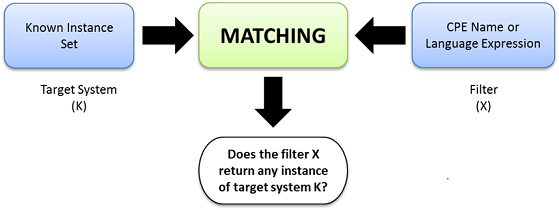

Introduction
============

Common Platform Enumeration (CPE) is a standardized method of describing and identifying classes of applications, operating systems, and hardware devices present among an enterprise's computing assets. CPE does not identify unique instantiations of products on systems, such as the installation of XYZ Visualizer Enterprise Suite 4.2.3 with serial number Q472B987P113. Rather, CPE identifies abstract classes of products, such as XYZ Visualizer Enterprise Suite 4.2.3, XYZ Visualizer Enterprise Suite (all versions), or XYZ Visualizer (all variations).

IT management tools can collect information about installed products, identifying these products using their CPE Names, and then use this standardized information to help make fully or partially automated decisions regarding the assets. For example, identifying the presence of XYZ Visualizer Enterprise Suite could trigger a vulnerability management tool to check the system for known vulnerabilities in the software, and also trigger a configuration management tool to verify that the software is configured securely in accordance with the organization's policies. This example illustrates how CPE Names can be used as a standardized source of information for enforcing and verifying IT management policies across tools [`1 <http://scap.nist.gov/specifications/cpe/>`_].

CPE provides [`2 <http://cpe.mitre.org/about/>`_]:

- A standard machine-readable format for encoding names of IT products and platforms (naming).
- A set of procedures for comparing names (name matching).
- A language for constructing "applicability statements" that combine CPE Names with simple logical operators (language matching).
- A standard notion of a CPE Dictionary.

For more information, please visit the official website of CPE, maintained by MITRE: `<http://cpe.mitre.org/>`_

Matching
--------

Matching [5] is the process of determining if a given CPE Name or CPE Language statement specifies a platform that is defined by a set of known CPE Names. It helps define the relationship between different CPE Names (or language statements).

Conceptual model
~~~~~~~~~~~~~~~~

The conceptual model for matching consists of two steps:

#. Make a list of all the CPE Names and logical connections.
#. For each name, check whether the target system has the hardware, software, or operating system indicated by the name. If the check succeeds for all names, and satisfies the logical constraints, then the target is an instance of the CPE Name or Language representation.

Matching Algorithm: Known Instance Based Matching
~~~~~~~~~~~~~~~~~~~~~~~~~~~~~~~~~~~~~~~~~~~~~~~~~

Two elements participate in the matching process: the known instance set (CPE Names that define the target system) and the candidate CPE Name or Language expression. The algorithm applies the "filter" indicated by X and replies to the question: "Does the filter X return any instance of target system K?"

The figure bellow illustrates the basic concept of known instance based matching:

Matching consists of two algorithms.

* CPE\_Name\_Match:

  * This algorithm accepts a set of CPE Names K and a candidate CPE Name X.
  * It returns true if X matches any member of K, and false otherwise.

* CPE\_Language\_Match:

  * This algorithm accepts a set of CPE Names K and a candidate expression E.
  * It returns true if the expression can be satisfied by name matching against the members of K, and false otherwise.
