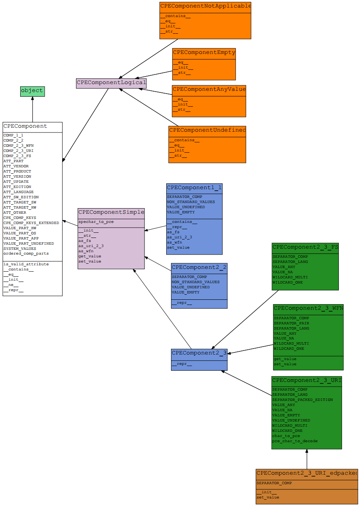

CPEComponent hierarchy
======================

This section contains the classes associated with the types of components of versions of CPE Names implemented in this package: logical and simple.

Class list
----------

The generic component class is:

.. toctree::

    cpecomphierarchy/cpecomp

The logical components classes are:

.. toctree::

    cpecomphierarchy/cpecomp_logical
    cpecomphierarchy/cpecomp_anyvalue
    cpecomphierarchy/cpecomp_empty
    cpecomphierarchy/cpecomp_notapplicable
    cpecomphierarchy/cpecomp_undefined

The simple components classes are:

.. toctree::

    cpecomphierarchy/cpecomp_simple
    cpecomphierarchy/cpecomp1_1
    cpecomphierarchy/cpecomp2_2
    cpecomphierarchy/cpecomp2_3
    cpecomphierarchy/cpecomp2_3_uri
    cpecomphierarchy/cpecomp2_3_uri_edpacked
    cpecomphierarchy/cpecomp2_3_wfn
    cpecomphierarchy/cpecomp2_3_fs

Class diagram
-------------

The class diagrams of CPE component hierarchy are available in multiple format: PNG, PDF and PYNS (output format of PyNSource tool). Listed below are the download links of these diagrams and their formats:

* Classes with public and private attributes and methods:

  * `Formato PNG <../_static/cpecomp/cpecomp_model_all.png>`__
  * `Formato PDF <../_static/cpecomp/cpecomp_model_all.pyns.pdf>`__
  * `Formato PYNS <../_static/cpecomp/cpecomp_model_all.pyns>`__

* Classes with only public attributes and methods:

  * `Formato PNG <../_static/cpecomp/cpecomp_model_public.png>`__
  * `Formato PDF <../_static/cpecomp/cpecomp_model_public.pyns.pdf>`__
  * `Formato PYNS <../_static/cpecomp/cpecomp_model_public.pyns>`__

Next image presents the public attributes and methods of CPE component classes:

