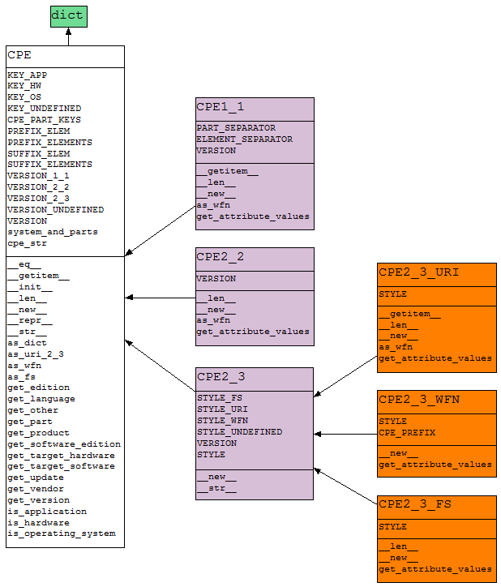

CPE hierarchy
=============

This section contains the classes associated with versions of CPE specification implemented in this package.

Class list
----------

.. toctree::
    :maxdepth: 2

    cpehierarchy/cpe
    cpehierarchy/cpe1_1
    cpehierarchy/cpe2_2
    cpehierarchy/cpe2_3
    cpehierarchy/cpe2_3_uri
    cpehierarchy/cpe2_3_wfn
    cpehierarchy/cpe2_3_fs

Class diagram
-------------

The class diagrams of CPE hierarchy are available in multiple format: PNG, PDF and PYNS (output format of PyNSource tool). Listed below are the download links of these diagrams and their formats:

* Classes with public and private attributes and methods:

  * `Formato PNG <../_static/cpe/cpe_model_all.png>`__
  * `Formato PDF <../_static/cpe/cpe_model_all.pyns.pdf>`__
  * `Formato PYNS <../_static/cpe/cpe_model_all.pyns>`__

* Classes with only public attributes and methods:

  * `Formato PNG <../_static/cpe/cpe_model_public.png>`__
  * `Formato PDF <../_static/cpe/cpe_model_public.pyns.pdf>`__
  * `Formato PYNS <../_static/cpe/cpe_model_public.pyns>`__

Next image presents the public attributes and methods of CPE classes:

