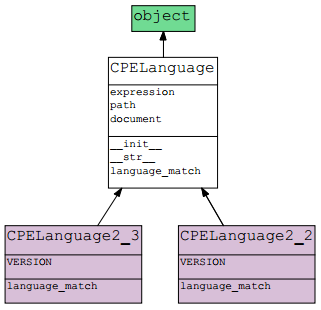

CPELanguage hierarchy
=====================

This section contains the classes associated with the language matching algorithm of versions of CPE specification implemented in this package.

Class list
----------

.. toctree::
    :maxdepth: 2

    cpelanghierarchy/cpelang
    cpelanghierarchy/cpelang2_2
    cpelanghierarchy/cpelang2_3

Class diagram
-------------

The class diagrams of CPELanguage hierarchy are available in multiple format: PNG, PDF and PYNS (output format of PyNSource tool). Listed below are the download links of these diagrams and their formats:

* Classes with public and private attributes and methods:

  * `Formato PNG <../_static/cpelang/cpelang_model_all.png>`__
  * `Formato PDF <../_static/cpelang/cpelang_model_all.pyns.pdf>`__
  * `Formato PYNS <../_static/cpelang/cpelang_model_all.pyns>`__

* Classes with only public attributes and methods:

  * `Formato PNG <../_static/cpelang/cpelang_model_public.png>`__
  * `Formato PDF <../_static/cpelang/cpelang_model_public.pyns.pdf>`__
  * `Formato PYNS <../_static/cpelang/cpelang_model_public.pyns>`__

Next image presents the public attributes and methods of CPELanguage classes:

